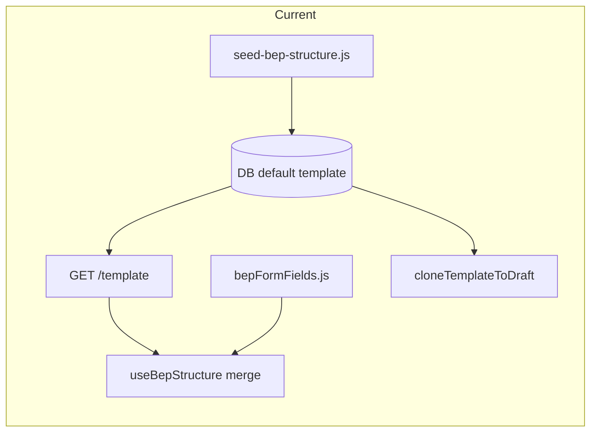
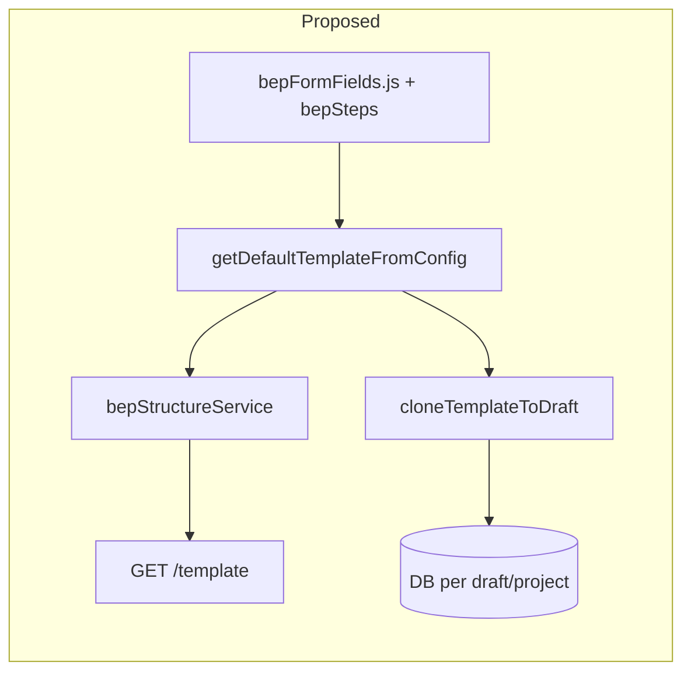

# BEP Structure: CONFIG as Single Source of Truth

## Problem

Adding new fields or sections to the BEP editor (in [src/config/bepFormFields.js](src/config/bepFormFields.js)) does not show up unless:

1. The **seed script** ([server/scripts/seed-bep-structure.js](server/scripts/seed-bep-structure.js)) is updated with the same structure and run, or
2. A **frontend workaround** in [src/components/form-builder/useBepStructure.js](src/components/form-builder/useBepStructure.js) merges fields from CONFIG when `!hasCustomStructure`.

There are effectively **three** sources of truth: `bepFormFields.js`, the seed script (hardcoded STEPS/SHARED_FIELDS), and the DB. Clone/reset still use the DB template, so cloned drafts get the old structure unless the DB was re-seeded.

## Goal

- **Single source of truth:** [src/config/bepFormFields.js](src/config/bepFormFields.js) and [src/config/bepSteps.js](src/config/bepSteps.js) (via [bepConfig.js](src/config/bepConfig.js)) define the default BEP structure.
- **No manual sync:** Adding or changing fields/sections in config is enough; no seed run and no frontend merge required.
- **Clone and reset use CONFIG:** When cloning template to a draft or resetting to default, the structure is built from CONFIG, not from the DB default template.

## Current flow (simplified)

## Proposed flow

- **Default template** is never read from DB for "global" default; it is built from CONFIG when needed.
- **DB** only stores draft- or project-specific structure (after clone/customization).

---

## Implementation plan

### 1. Backend: Load CONFIG and build default template from it

**File:** [server/services/bepStructureService.js](server/services/bepStructureService.js)

- **Load CONFIG** in the service the same way [server/services/htmlTemplateService.js](server/services/htmlTemplateService.js) does (e.g. `require('../../src/config/bepConfig')` with cache clear and fallback). Reuse or extract a small shared helper (e.g. `loadBepConfig()`) so both services use the same logic and path resolution.
- **Add `getDefaultTemplateFromConfig(bepType)`** that:
  - Uses CONFIG.steps (or equivalent) for step list and CONFIG.getFormFields(bepType, stepIndex) for each step's fields.
  - Returns an array of steps in the same shape as current `getDefaultTemplate()`: each step has `id` (synthetic, e.g. UUID or `config-step-${index}`), `step_number`, `title`, `description`, `category`, `order_index`, `fields`.
  - Each field has `field_id` (from config `name`), `label`, `type`, `number`, `config` (object: `rows`, `columns`, `options`, `diagramKey`, etc.), `is_required`, `placeholder`, and a synthetic `id` if needed for cloning.
- **Map config field shape to DB/API field shape** in one place (e.g. a `configFieldToApiField(f, stepId, orderIndex)` helper) so step/field creation and API response stay consistent.

### 2. Backend: GET /template always from CONFIG

**File:** [server/routes/bep-structure.js](server/routes/bep-structure.js)

- **GET /api/bep-structure/template:** Call `bepStructureService.getDefaultTemplateFromConfig(bepType)` and return that as `data`. Do not read from DB for the default template. Response shape stays the same (array of steps with nested fields) so the frontend does not need to change for this endpoint.

### 3. Backend: Clone and reset use CONFIG-built template

**File:** [server/services/bepStructureService.js](server/services/bepStructureService.js)

- **cloneTemplateToDraft(draftId):** Instead of `getDefaultTemplate()` (DB), call `getDefaultTemplateFromConfig()`. Iterate over the returned steps and fields; for each step call `createStep` with `draft_id: draftId` and new IDs; for each field call `createField` with the new `step_id`, `draft_id`, and mapped config. No dependency on DB default template rows.
- **resetDraftToDefault(draftId):** Keep current behavior (delete draft's steps/fields, then clone). The "clone" step will use the new CONFIG-based clone above, so reset also becomes CONFIG-driven.
- **cloneTemplateToProject(projectId)** (if still used): Same idea — use `getDefaultTemplateFromConfig()` as the source instead of `getDefaultTemplate()`.
- **resetProjectToDefault(projectId):** Same as today but the clone source is CONFIG-based.

### 4. Frontend: Remove CONFIG merge from useBepStructure

**File:** [src/components/form-builder/useBepStructure.js](src/components/form-builder/useBepStructure.js)

- **Remove** the logic that, when `useConfigForFields`, rebuilds `finalFields` from CONFIG (and the `CONFIG` import). The API will now always return the CONFIG-built template when there is no custom structure, so the frontend can use the response as-is.
- **Keep** the rest of the fetch flow (draft vs project vs template, `hasCustomStructure`, setting steps and fields from the API response). No change to clone/reset API calls.

### 5. Seed script: Deprecate or drive from CONFIG

**File:** [server/scripts/seed-bep-structure.js](server/scripts/seed-bep-structure.js)

- **Option A (recommended):** Change the seed script to **build steps and fields from CONFIG** (require bepConfig, call getFormFields for each step index, map to DB row shape) and then insert into DB. So the script has zero hardcoded field definitions; it becomes "sync CONFIG into DB default template." Useful for environments that still expect default template rows in DB (e.g. legacy or a specific deployment). Run seed only when you want to backfill or refresh the DB default.
- **Option B:** Deprecate the seed script for "default" template and document that the default is CONFIG-only; keep the script only for one-off backfills if ever needed.

### 6. Documentation and tests

- **README or AGENTS.md:** State that the default BEP structure is defined only in `src/config/bepFormFields.js` and `src/config/bepSteps.js`; adding or changing fields/sections there is sufficient and no seed run is required for the editor to show the new structure.
- **Tests:** Add or adjust a test that GET /template returns a structure that includes a known field from CONFIG (e.g. `levelOfInformationMatrix` for step 5). Optionally test that clone-to-draft creates the same structure (same step/field counts or key names).

---

## Edge cases and notes

- **CONFIG load failure:** If the server cannot load bepConfig (e.g. path or module error), `getDefaultTemplateFromConfig` should throw or return a clear error so the API can respond with 500 or a structured error; avoid falling back to an empty or stale DB default unless you explicitly design that fallback.
- **Step order and indices:** CONFIG.steps order and getFormFields(bepType, stepIndex) must align (stepIndex 0 = first step, etc.). This is already the case; keep it that way.
- **Backward compatibility:** Existing drafts with custom structure are unchanged (they already have their own steps/fields in DB). New drafts and "reset to default" will get CONFIG-built structure. No migration of existing data required.

---

## Summary of file changes

| File | Change |
|------|--------|
| [server/services/bepStructureService.js](server/services/bepStructureService.js) | Load CONFIG; add `getDefaultTemplateFromConfig(bepType)`; make clone/reset use it instead of DB default template. |
| [server/routes/bep-structure.js](server/routes/bep-structure.js) | GET /template → call `getDefaultTemplateFromConfig(bepType)`. |
| [src/components/form-builder/useBepStructure.js](src/components/form-builder/useBepStructure.js) | Remove CONFIG import and the "useConfigForFields" field-merge block. |
| [server/scripts/seed-bep-structure.js](server/scripts/seed-bep-structure.js) | Refactor to build from CONFIG (require bepConfig, iterate steps/fields) or deprecate. |
| Docs / tests | Note CONFIG as single source of truth; add or update test for GET /template (and optionally clone). |

After this, adding a new field or section in `bepFormFields.js` (and step in `bepSteps.js` if needed) is enough for it to appear in the editor and in clone/reset, with no seed run and no frontend merge.
