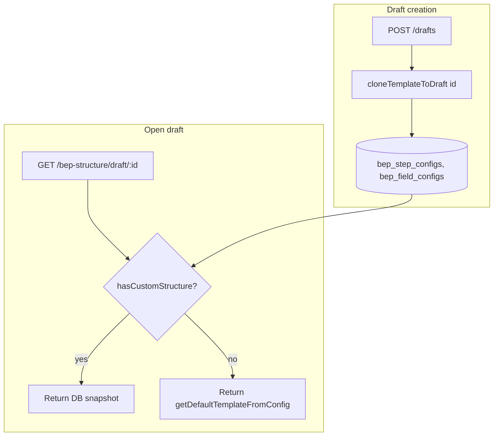
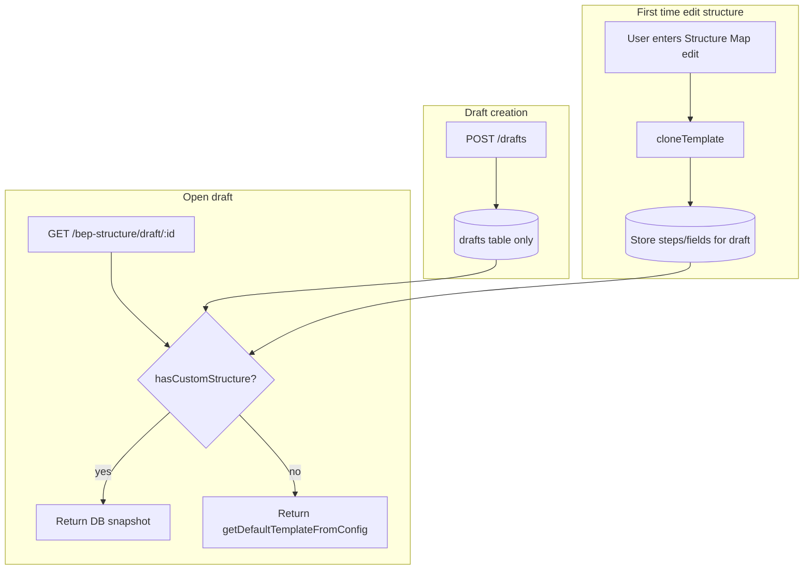

# Why New BEP Fields Don't Show Up — Root Cause and Fix

## Summary

**Root cause:** Every new draft gets a **frozen copy** of the BEP structure (steps + fields) stored in the DB at creation time. The form always loads structure from the API, which for drafts returns that stored copy. So CONFIG changes (new fields, new steps) only affect **new** drafts created **after** the change; existing drafts keep the old snapshot.

**Fix:** Stop cloning the template into the draft when the draft is created. Use CONFIG as the live source until the user actually customizes the structure (e.g. enters the Structure Map editor). Then clone once and store.

---

## Current Flow (Why It Breaks)

1. **Draft creation** ([server/routes/drafts.js](server/routes/drafts.js)): After inserting the draft row, the server calls `bepStructureService.cloneTemplateToDraft(id)`. That reads CONFIG **once** and writes steps/fields into `bep_step_configs` and `bep_field_configs` with `draft_id = id`.

2. **"Custom structure"** means "this draft has at least one step row in the DB" ([hasCustomStructureForDraft](server/services/bepStructureService.js)). So **every** draft has custom structure immediately after creation.

3. **Loading structure** ([getStructureForDraft](server/services/bepStructureService.js)): If the draft has custom structure, we return the **stored** steps and fields from the DB. We do **not** re-read CONFIG. So any change you make to [bepFormFieldsData.js](src/config/bepFormFieldsData.js) or [bepStepsData.js](src/config/bepStepsData.js) after the draft was created never appears for that draft.

4. **Merge fix** ([mergeMissingReferenceFields](server/services/bepStructureService.js)): We inject only the two hardcoded reference fields (EIR, LOIN) when missing. That helps those two fields only; any other new field or step still doesn’t show.

So: **CONFIG is the source of truth for the default template, but each draft gets a one-time snapshot at creation. New CONFIG only applies to drafts created after the change (or after "Reset to default").**

---

## Robust Fix: Don’t Clone on Draft Creation

**Idea:** Treat “custom structure” as “user (or system) has explicitly stored a structure for this draft.” A newly created draft has **no** structure in the DB. When loading that draft, the API returns `getDefaultTemplateFromConfig(bepType)` so the user always sees **current** CONFIG. Structure is only written to the DB when:

- The user opens the Structure Map and enters edit mode (then we clone CONFIG to the draft so they can customize), or
- Some other flow explicitly clones/resets.

**Changes:**

| Where | What |
|-------|------|
| [server/routes/drafts.js](server/routes/drafts.js) | **Remove** the auto-clone block after draft creation (the `try { bepStructureService.cloneTemplateToDraft(id); } catch ...`). Do not call `cloneTemplateToDraft` when creating a draft. |
| [server/services/bepStructureService.js](server/services/bepStructureService.js) | No change to `getStructureForDraft`: when `!hasCustomStructureForDraft(draftId)` it already returns `getDefaultTemplateFromConfig(bepType)`. |
| Optional | When cloning to draft (e.g. from clone-to-draft API), pass `bepType` (from draft type or request body) so pre-appointment drafts get the correct template. |

**Result:**

- **New drafts:** No step/field rows for that `draft_id` → `hasCustomStructureForDraft` is false → `getStructureForDraft` returns `getDefaultTemplateFromConfig(bepType)` → form shows **latest** CONFIG every time.
- **After user edits structure:** First time they enter Structure Map edit mode, the frontend calls `clone-to-draft` (as today). The draft then gets a copy of CONFIG in the DB; from then on it has “custom structure” and sees that snapshot until they “Reset to default.”
- **Existing drafts:** Drafts that already have steps/fields in the DB keep their current behaviour (stored structure). They can use “Reset to default” to replace it with current CONFIG.

No change to form data (draft `data` JSON); only when and whether we write structure rows for the draft.

---

## Flow After Fix

---

## Backward compatibility

- **Existing drafts** that already have steps/fields in the DB (created before this fix) keep showing their stored structure. Use **Reset to default** in the Structure Map to replace it with current CONFIG.
- **New drafts** (created after this fix) have no structure rows initially, so they always get `getDefaultTemplateFromConfig(bepType)` and see latest CONFIG until the user enters Structure Map edit (which then clones and stores).

## Summary

- **Why new things don’t show:** Structure was cloned into the DB once per draft at creation, so the form always read a stale snapshot for existing drafts.
- **Robust fix:** Don’t clone on draft creation. Use CONFIG live until the draft has custom structure (e.g. after first structure edit). Then CONFIG updates show up for all drafts that haven’t been customized yet.
